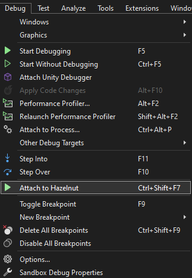

# Hazel Tools for Visual Studio

Hazel Tools is an extension for Visual Studio 2022 that adds integration with the [Hazel](https://hazelengine.com/) game engine.

This extension does **NOT** work for [Hazel 2D](https://github.com/TheCherno/Hazel)!

## Post-Installation Notes
If you don't see the "Attach to Hazelnut" button in the Debug menu after installing the extension, please go into the "Manage Extension" window and make sure that the "Hazel Tools" extension is enabled.

If it's disabled by default you'll need to manually enable it and then restart Visual Studio. Keep in mind the "Attach to Hazelnut" button will only appear if you have a solution with a C# project in it open.

## Attaching to Hazelnut

Hazel Tool for Visual Studio adds debugging support for Hazel C# scripts in Visual Studio. To use the extension simply open your games C# solution (located in the projects base folder), go to `Debug -> Attach to Hazelnut`, or use they keyboard shortcut (Defaults to `Ctrl+Shift+F7`). **NOTE:** A running instance of Hazelnut **must** have the project open in order for this to work.

## Requirements
* Hazelnut.
* Visual Studio 2022. Visual Studio 2019 is not officially supported.
